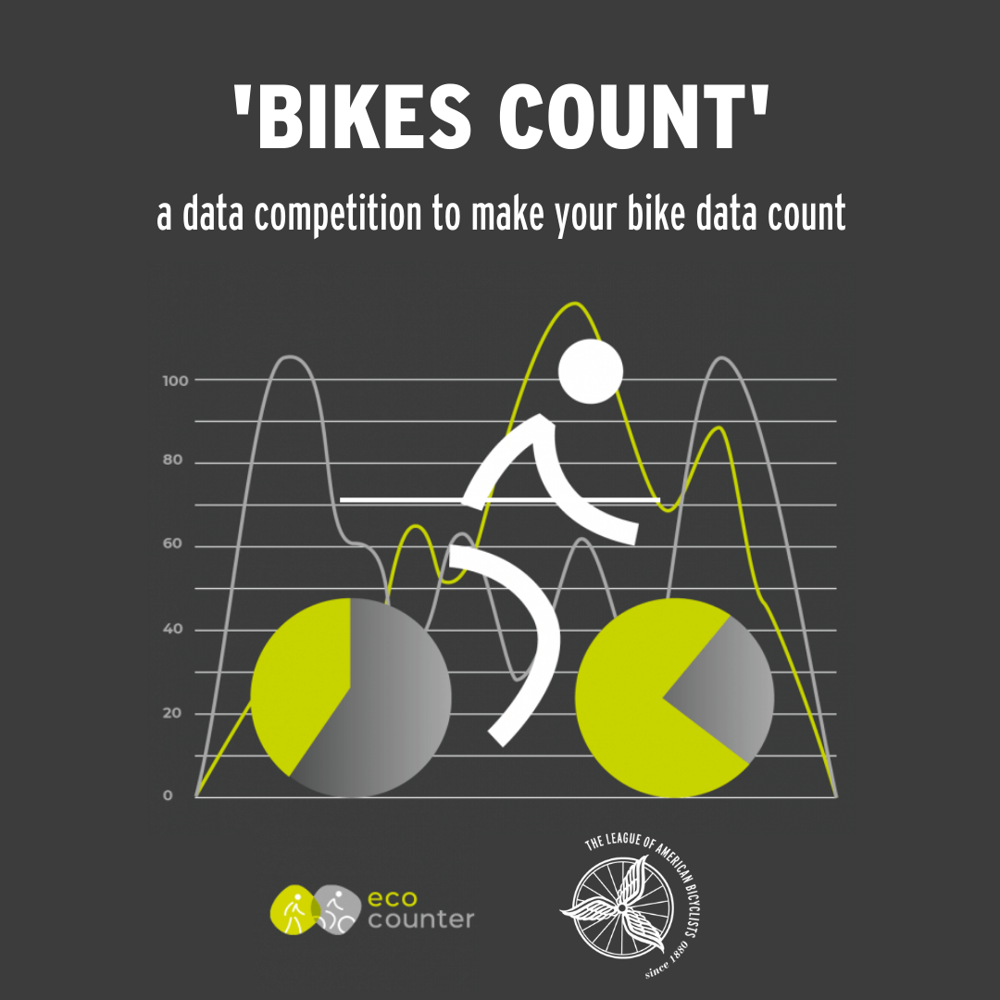
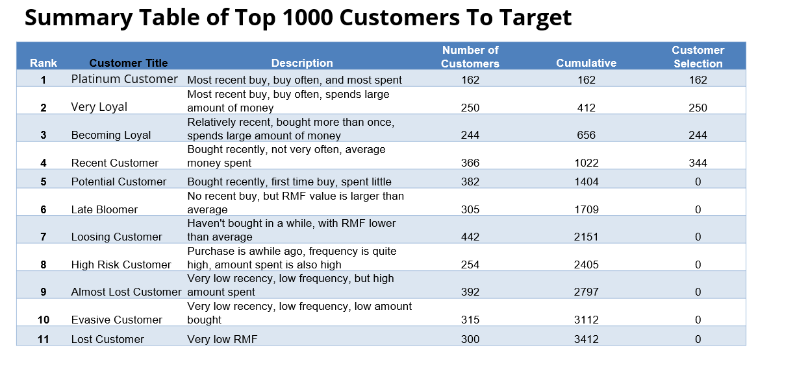
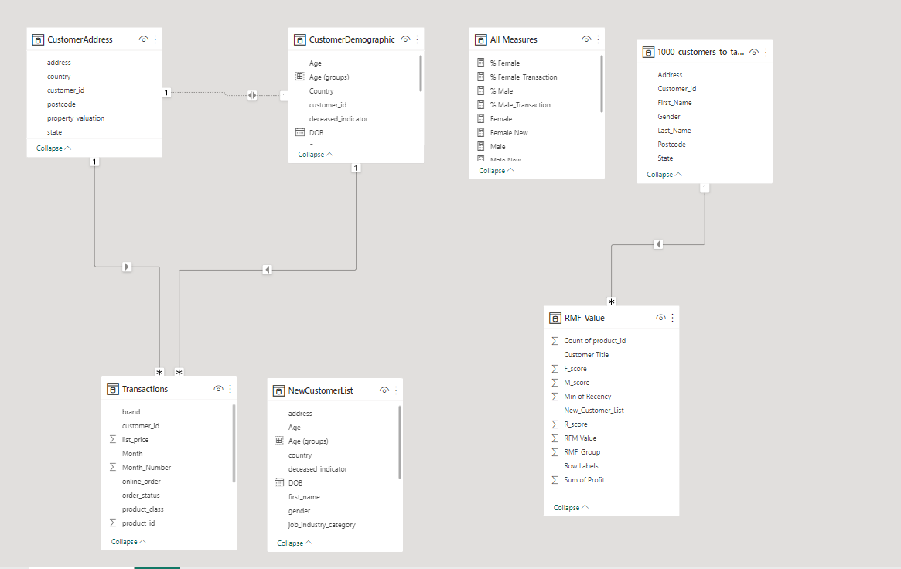
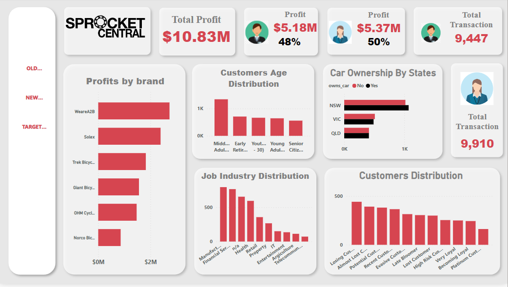
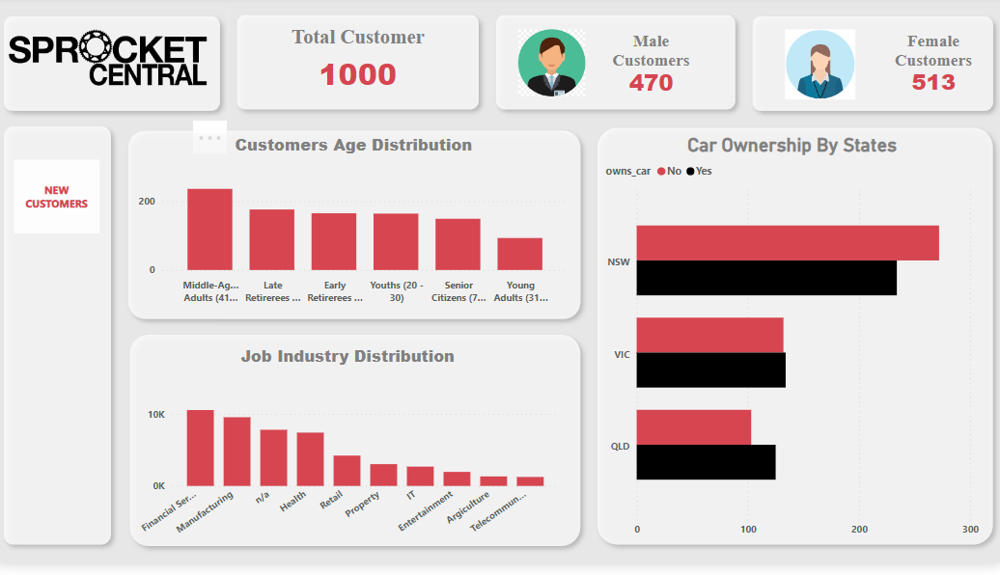
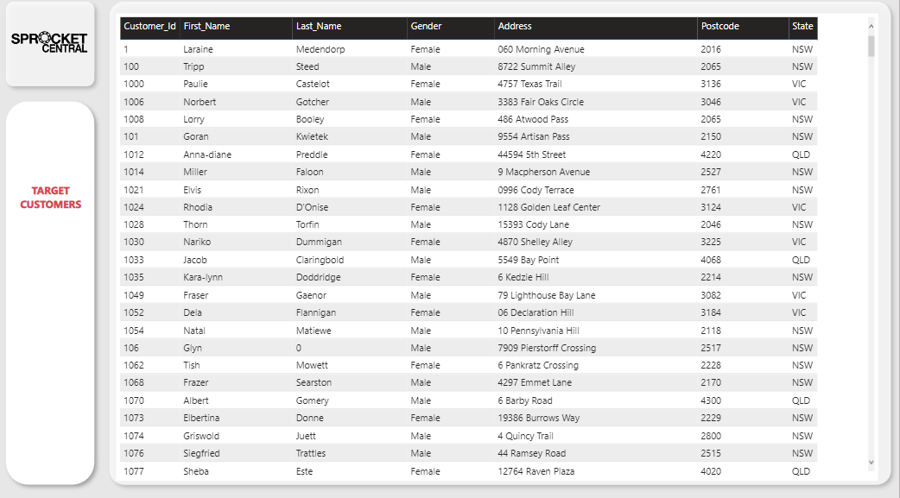
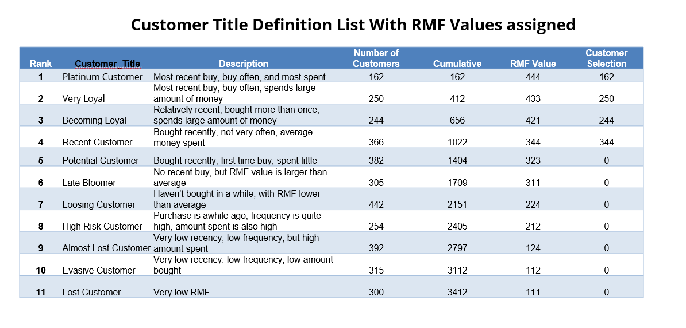

# Sprocket-Central-Pty-Ltd
***

## Introduction
This is a power BI project on bike related sales analysis of Sprocket Central Pty Ltd. The project is to analyze and derive insights to answer critical questions and help Sprocket Central Pty make data driven decisions.

**_Disclaimer_**: _All datasets are from Forage._

## Problem Statements
1. The marketing team of Sprocket Central is looking to boost sales by analyzing the provided datasets.
2. With the 3 datasets provided, the aim is to identify and recommend 1000 customers that the cycling company should target to drive sales.

## Key Issues for Data Quality Assessment:

1. Accuracy: Correct values
2. Completeness: Data fields with values
3. Consistency: Values free from contradiction
4. Currency: Values up to date
5. Relevancy: Data items with value meta-data
6. Validity: Data containing allowable values
7. Uniqueness: Records that are duplicated

## Skills/ Concepts Demonstrated:

The following Power BI features were incoporated:
- Bookmarking,
- DAX,
- Quick measures,
- Page navigation,
- Data cleaning,
- Modelling,
- Filters,
- Tooltips,
- Button.

## Model Development

- RMF analysis is used to determine which customers a business should target to increase its revenue and value.
- The RMF (Recency, Frequency, and Monetary) model shows customers that have displayed high levels of engagement with the business in the three categories mentioned.

Automatically generated relationships are adjusted to remove and replace unwanted relationships with the required, thus:

---
The model is a star schema.

## Visualization:

The report comprises 3 pages:
1. Old Customers
2. New Customers
3. 1000 Target Customers

You can interact with the report [here] (https://app.powerbi.com/groups/me/reports/54924548-2477-428e-a93d-040c379a6c6e/ReportSection8e575cb83aaf9ee38d6b)

## Analysis

### Old customers:

- The total profit made is $10.82M.
- Over the past 3 years, about 51% of bike purchases were made by females compared to 47% made by males, with the unknown gender contributing to just about 2% of the total bike purchases.
- The bulk of the bike related purchases were from NSW with the least coming from QLD.
- Majority of the customers are middle age (41 – 51).
- With the top 4 best selling job industries are financial services, manufacturing, health and the unknown industries with the worst being telecommunication.
- NSW has the largest number of non car owners and seems to have the highest number of people from which data was collected.
- The brand with the highest selling profit is WeareA2B with the least being Norco bicycles.

### New Customers:

- The total number os customers is 1000 with females having 513 and males 470.
-  Majority of the customers are middle age (41 – 51).
- The top four industries of the new customers are, financial services, manufacturing, health and the unknown industries with the worst being telecommunication.
- NSW has the largest number of car owners and QLD the least.

### Target Customers:

## Interpretation/ Conclusion and Recommendation

The top 1000 customers to target are all in the Platinum customer, Very loyal, Becoming loyal or Recent customers title range.

